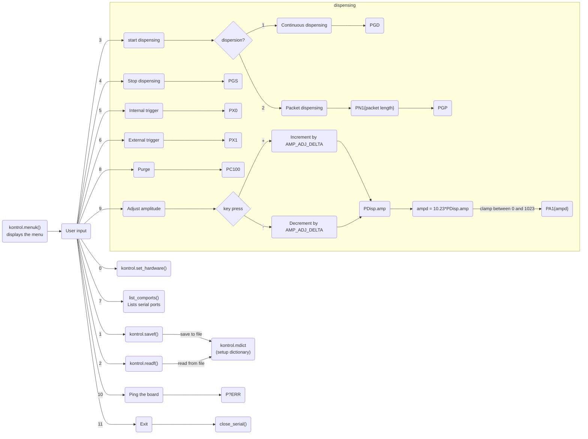

# dls-polypico

A Python interface to the Polypico Dispenser system.

Originally shared by Nikolay Pavlov nikolaypavlov@polypico.com

## Getting started

`pipenv install`

`pipenv run python LinPolyPiCo-V5.py`

## Description

First looks for the platform.
- if Windows: look at COM ports
- if Linux: look at `/dev/ttyUSB`

It then sets the baud rate to `115200`

## Known serial commands

### Dispensing control
- `PGS`: stops dispensing
- `PGD`: continuous dispensing
- `PN1{packet_length}` then `PGP`: packet dispensing
- `PC100`: purge (`100` is set as a constant as `PURGE_CONST` -- could this be a time?)
- `PA1{amp}`: set amplitude to `amp` (+int between 0 and 1023)

### Triggering
- `PX0`: internal trigger
- `PX1`: external trigger

### Control
- `P?ERR`: used to "ping" the board. Not sure if an actual command or just used to see if the board responds with an error.

## Usage

TODO 

Use examples liberally, and show the expected output if you can. It's helpful to have inline the smallest example of usage that you can demonstrate, while providing links to more sophisticated examples if they are too long to reasonably include in the README.

## Support

TODO

Tell people where they can go to for help. It can be any combination of an issue tracker, a chat room, an email address, etc.

## Authors and acknowledgment

TODO

Show your appreciation to those who have contributed to the project.

## License

TODO -- check with Polypico
For open source projects, say how it is licensed.

