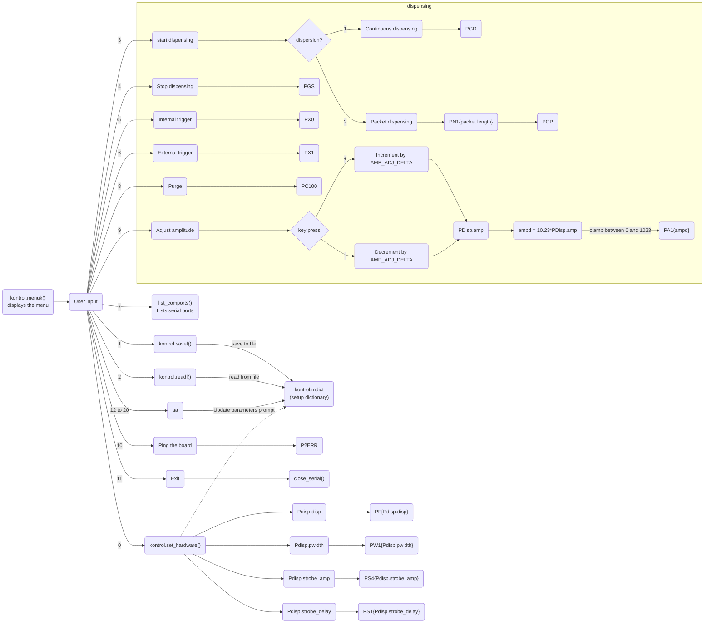

# dls-polypico

A Python interface to the Polypico Dispenser system. 

The project is not officially related to Polypico and is not supported by Polypico, but it is published with permission from them.

## Getting started

`pipenv install`

`pipenv run python LinPolyPiCo-V5.py`


## Description

The following is a reverse engineering / documentation effort of the original `LinPolyPiCo-V5.py` code generously shared by Polypico.

The code first looks for the platform.
- if Windows: look at COM ports
- if Linux: look at `/dev/ttyUSB`

It then sets the baud rate to `115200`




## Known serial commands

### Dispensing control
- `PGS`: stops dispensing
- `PGD`: continuous dispensing
- `PN1{packet_length}` then `PGP`: packet dispensing
- `PC100`: purge (`100` is set as a constant as `PURGE_CONST` -- could this be a time?)

### Dispensing settings

A few of these parameters are converted from the prompt from a % (0-100) to a +int value (0-1023); this is detailed below where it applies

- `PA1{amp}`: set amplitude to `amp`. +int (0, 1023) (0%-100% in prompt)
- `PF{disp}`: dispersion frequency in Hz. +int (10,10000)
- `PW{pulse_width}`: Pulse width (in % of cycle?). +int (102,1023) (10%-100% in prompt)
- `PN1{packet_length}`: packet length (1,10000)
- `PS4{strobe_amp}`: strobe ampitude. +int (0, 1023) (0%-100% in prompt)
- `PS1{strobe_delay}`: strobe delay in us. Prompt: (0.6-312.5)
    - Multiplied by `F0`, set to 16.0 (16.0 MHz, clock of the strobe timer)
    - this makes it an integer between 10 (9.6 rounded up) to 5000


### Triggering
- `PX0`: internal trigger
- `PX1`: external trigger

### Control
- `P?ERR`: used to "ping" the board. Not sure if an actual command or just used to see if the board responds with an error.


## Usage

### Python interface

This is not available yet, but ideally one will be able to write something as follows:

```python
import DLSpolypico as polypico

dispenser = polypico.Dispenser(
    port = "COM1",
)

dispenser.setup(
    amplitude = 100,
    dispersion_freq = 1000,
    pulse_width = 50,
    strobe_amp = 50,
    strobe_delay = 15,
    trigger = "internal",
)

dispenser.dispense(mode="continuous")
# or an alias:
dispenser.dispense_continuous()

dispenser.dispense(mode="packet", packet_length=1000)
# or an alias:
dispenser.dispense_packet(packet_length=1000)

# timing code goes here...

dispenser.stop()

```


## Support

The code is not supported officially by Polypico. For issues or feature request feel free to use the issue tracker on Github adding details of the features you would like to see.

## Authors and acknowledgment

Many Thanks to Nikolay Pavlov and Gabriel Leen at Polypico for the original Python code, and for agreeing to release this code in the public domain.

The project is currently maintained by Davide Crivelli at Diamond Light Source. We are open to contributions from anyone, just get in touch, open an issue or create a pull request.

## License

TODO -- check with Polypico
For open source projects, say how it is licensed.

